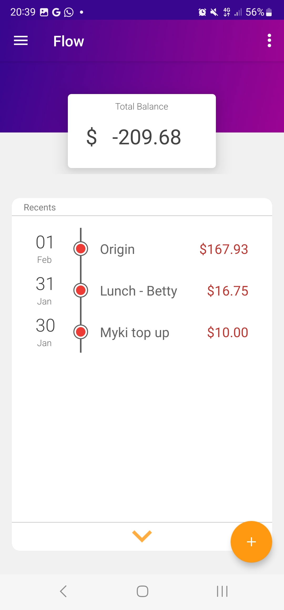
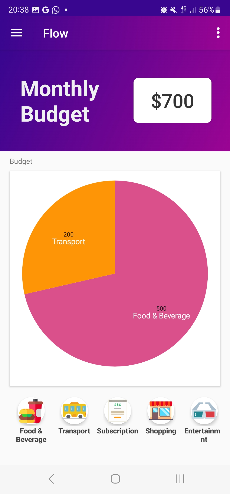
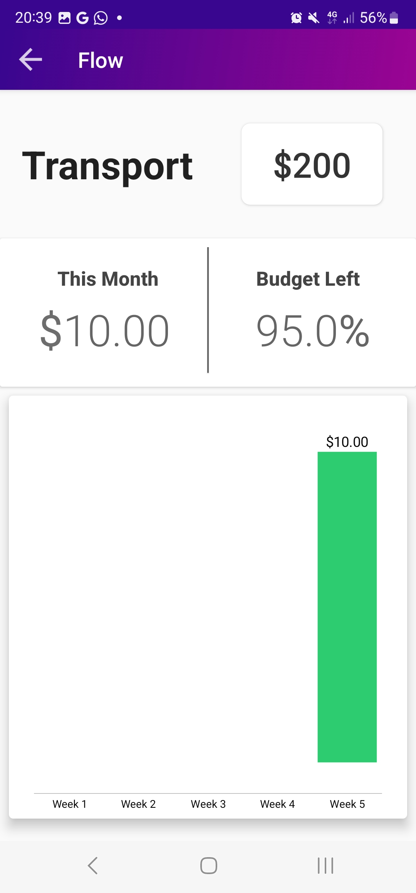

# Flow - Financial Tracking App

[**Apk file**](app/release/app-release.apk)

## 📖 Motivation
Flow is an financial tracking app created in Android Java. It was a good way to solve two problems i had at that time: learning android development and budget tracking. It was deployed to google play store at one point but was brought down for inactivity  

## 🚀 Features
- Set Budget and keep track of categorised expenses
- Ability to set preset of expenses such as utilities, transport where spending is consistent
- SQLite to store data locally and in a relational format.
- Notifications to alert on expenses

## 👀 Examples

  
  
   
  

## 🌲 Improvements
**Authentication, backups and architecture** — All of the logic,calculation and data lives locally in the device. Potentially, if the data is corrupted, there was no way of recovering it. Could use a backend like firebase and a little layering.

**API integration with banks of your choice** — At the time of the developing this app, banking API was very restrictive and you needed to be a verified business. Banks that support [OpenBanking](https://developer.nab.com.au/docs/open-banking) open up much more possibilities as to how a financial app can help users manage their finance

**Switching to kotlin and upgrading dependencies** — This was written before Android 7.0 (Oreo) came out and there are probably lots of outdated dependencies. Potentially, a PWA might be a better option.

**Material-like design** — This is a personal opinion but shadows interaction makes the UI feels a little clunky. Could use a snappier UX.